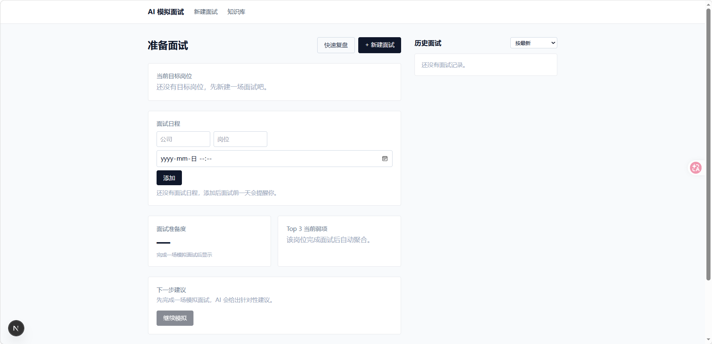
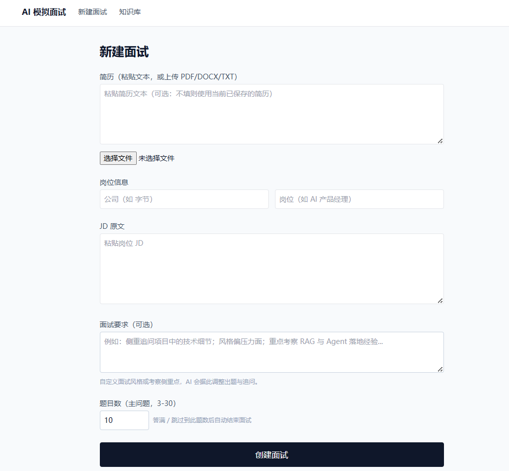
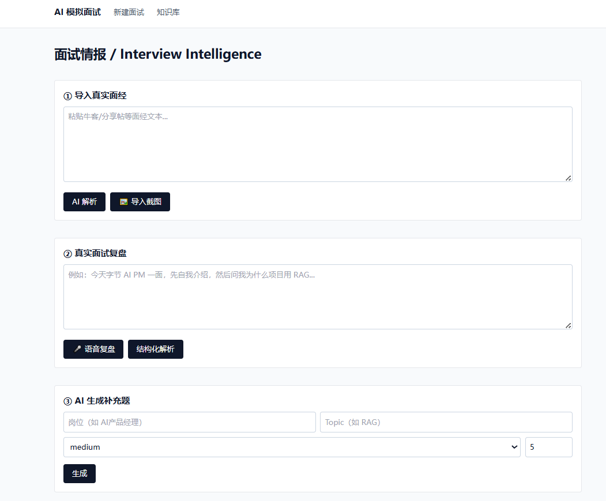

# Personal AI Interview Agent（AI 个性化模拟面试）

> 根据「我是谁 + 我面什么岗位 + 我面什么公司 + 真实面试问过什么 + 我过去表现如何」，
> 自动制定并执行一套**持续进化**的个性化模拟面试。

个人专属的本地 AI 面试准备 Agent：上传简历 + 粘贴 JD，系统完成岗位能力建模、差距分析、
模拟面试规划、问题检索与生成、动态追问、结构化评估与最终报告；真实面试后通过文字/语音复盘
沉淀个人面经，让下一次模拟越来越贴近真实面试。

## 📸 产品截图







## ✨ 功能特性

- **个性化分析链路**：简历解析（PDF/DOCX/文本）→ JD 能力模型（Product/AI/Technical/Business/Behavioral 五类）→ 差距分析 → 面试规划
- **模拟面试引擎**：手写状态机，一次一问；动态追问（DEEP_DIVE / CHALLENGE / COUNTERFACTUAL 等 9 种决策）；六维度结构化评分；难度自适应
- **双模式**：Coaching（边练边学，实时反馈） / Mock（贴近真实面试，结束后统一出报告）
- **长期记忆**：每轮回答沉淀 competency 分数 / 弱项 / 简历风险点，驱动后续面试更聚焦弱项
- **面经知识库**：文本粘贴或截图导入，自动抽取 / 归一化 / 分类 / 打分入库；检索优先级：个人真实面试 > 导入面经 > 题库 > LLM 生成兜底
- **真实面试复盘**：文字或语音转写 → AI 结构化抽取 → 用户确认入库，形成个人数据飞轮
- **面试日程 + 每日练习 + 提醒**：面试前一天微信推送提醒、开机提醒弹窗、基于记忆自动生成今日练习计划
- **来源诚实**：`MODEL_GENERATED` 题目绝不伪装成真实面经

## 🧱 技术栈

| 层 | 选型 |
|---|---|
| Web 框架 | Next.js 15（App Router）+ React 19 + Tailwind CSS |
| 语言 | TypeScript |
| 存储 | SQLite（Node 内置 `node:sqlite`）+ 余弦相似度向量检索（零外部依赖） |
| LLM | DeepSeek（deepseek-chat / deepseek-reasoner） |
| Embedding / STT / Vision | SiliconFlow（BAAI/bge-m3、SenseVoice、Qwen2.5-VL） |
| 校验 | Zod（所有 LLM 结构化输出，失败重试 + 降级） |

## 🔬 评测与验证

项目不满足于「做出来了」，而是自建评测集，把「一场面试题好不好」变成**可度量、可回归**的指标。

- **评测设计**：把「好的面试题」拆成 5 个可打分维度（岗位针对性 / 真实感 / 专业深度 / 可追问性 / 难度适配，各 1–5 分，附 1/5 分锚点）
- **评测集**：24 题（3 家公司 × 8 个考察点），四系统消融对比，LLM 裁判**盲评**（题目乱序、不标注来源）
- **关键发现（打脸）**：当前「真实面经 + 去锚点」实现反而**劣于** LLM 生成（总分 13.63 vs 20.13）——面经题平均仅 28 字、`quality_score` 全空、跨公司检索污染、去锚点丢失岗位针对性
- **修复**：把「问什么」与「怎么问」解耦——面经负责考察点、LLM 结合 JD 负责深化；检索限定目标公司 → 岗位针对性 3.83 → **5.0/5**，总分 **+79.5%**

复现方式与逐题数据见 [`interview-app/eval/`](interview-app/eval/README.md)。

## 📖 文档

| 文档 | 内容 |
|---|---|
| [PRD-v1.md](PRD-v1.md) | V1 产品需求（FR、验收标准、里程碑） |
| [design-document.md](design-document.md) | 完整产品设计（假设、数据模型、状态机、评分体系） |
| [PLAN-v1.md](PLAN-v1.md) | 技术方案与实现计划 |
| [CHANGELOG.md](CHANGELOG.md) | 版本演进记录（当前 v0.2.0） |
| [interview-app/README.md](interview-app/README.md) | 应用安装与运行指南 |

## 🚀 快速开始

```bash
cd interview-app
pnpm install
cp .env.example .env        # 填入 DEEPSEEK_API_KEY 与 SILICONFLOW_API_KEY
pnpm dev                    # 打开 http://localhost:3000
```

详细说明见 [interview-app/README.md](interview-app/README.md)。要求 Node.js ≥ 23.4（内置 `node:sqlite`）。

## 📁 项目结构

```
├── interview-app/          # 主应用（Next.js）
│   ├── src/app/            # 页面 + API 路由
│   ├── src/core/           # 纯 TS 业务核心（引擎/追问/评估/规划/报告）
│   ├── src/db/             # SQLite schema / 仓储 / 向量检索
│   ├── src/llm/            # DeepSeek + SiliconFlow provider 抽象
│   ├── server/             # 独立的面试提醒服务（可选部署）
│   └── scripts/            # 开机自启 / 提醒弹窗脚本
├── PRD-v1.md / design-document.md / PLAN-v1.md   # 产品与技术文档
└── CHANGELOG.md
```

## 🔒 隐私说明

本应用为本地单用户设计：简历、面经、面试记录全部存储在本地 SQLite（`data/`）与文件系统（`uploads/`），
API Key 仅存于 `.env`。这些路径均已加入 `.gitignore`，不会随仓库公开。

## 📄 License

[MIT](LICENSE)
